# 🏦 KlevaPay Backend API

[](https://nodejs.org/)
[](https://expressjs.com/)
[](https://www.mongodb.com/)
[](https://opensource.org/licenses/ISC)

Merchant-first payment gateway backend built with Node.js, Express, MongoDB, and on-chain integrations. KlevaPay helps businesses accept fiat and crypto payments, reconcile transactions, and settle merchants automatically.

## ✨ Highlights

- JWT-secured endpoints with rate limiting, Helmet, and granular validation
- Dual payment flows via Flutterwave & OPay plus smart-contract powered settlements
- Payment Intent lifecycle with checkout links, widgets, and status transitions
- Comprehensive transaction analytics (filters, stats, and recents) per merchant
- Centralized logging, error handling, and Swagger-powered documentation

## 🗺️ Project Structure at a Glance

### Mermaid Diagram

```mermaid
graph TD
  A[backend-klevapay]
  A --> app[app.js]
  A --> srv[server.js]
  A --> cfg[config/]
  cfg --> cfg1[connectDb.js]
  cfg --> cfg2[swagger.js]
  cfg --> cfg3[flutterwave.js]
  cfg --> cfg4[opay.js]
  A --> ctrl[controllers/]
  ctrl --> c1[merchantController.js]
  ctrl --> c2[paymentIntentController.js]
  ctrl --> c3[paymentIntegrationControllers.js]
  ctrl --> c4[cryptoIntegrationController.js]
  A --> routes[routes/]
  routes --> r1[merchantRoutes.js]
  routes --> r2[paymentIntentRoute.js]
  routes --> r3[transactionRoutes.js]
  routes --> r4[paymentintegrationRoute.js]
  routes --> r5[cryptoIntegration.js]
  A --> services[services/]
  services --> s1[PaymentIntentService.js]
  services --> s2[paymentIntegrationServices.js]
  services --> s3[cryptoIntegration.js]
  services --> s4[pricefeed.js]
  services --> s5[sendEmail.js]
  A --> models[models/]
   models --> m1[Merchant.js]
   models --> m2[PaymentInent.js]
  models --> m3[Transaction.js]
  models --> m4[User.js]
  models --> m5[Migration.js]
  A --> middlewares[middlewares/]
  middlewares --> mw1[authmiddleware.js]
  middlewares --> mw2[errorHandler.js]
  A --> utils[utils/]
  utils --> u1[jwtUtils.js]
  utils --> u2[otpUtils.js]
  utils --> u3[Flutter.js]
  utils --> u4[pricefeed.js]
  utils --> u5[usdt.js]
  A --> lib[lib/]
  lib --> l1[logger.js]
  lib --> l2[ApiError.js]
  A --> scripts[scripts/]
  scripts --> sc1[checkrates.js]
  A --> logs[logs/]
  logs --> lg1[combined.log]
  logs --> lg2[app.log]
  logs --> lg3[error.log]
```



### Directory Breakdown

| Path | Purpose |
|------|---------|
| `app.js` | Configures Express, middleware, Swagger, and mounts all routers. |
| `server.js` | Boots the HTTP server and database connection lifecycle. |
| `config/` | Database connector, Swagger options, and gateway credentials wiring. |
| `controllers/` | Request handlers for merchants, payment intents, fiat gateways, and crypto flows. |
| `middlewares/` | Global error handling, validation helpers, and JWT auth guard. |
| `models/` | Mongoose schemas for merchants, intents (`PaymentInent.js`), transactions, migrations, and users. |
| `routes/` | Express routers grouped by domain (`merchant`, `payment-intents`, `transactions`, `pay`, `crypto`). |
| `services/` | Business logic: payment intents, fiat gateway adapters, contract calls, pricing feeds, email. |
| `lib/` | Logger factory and reusable `ApiError` class. |
| `utils/` | JWT helpers, OTP utilities, Flutterwave abstractions, token constants. |
| `scripts/` | Operational scripts (e.g., rate checks). |
| `logs/` | Rotating winston log outputs. |

> Tip: Add `routes/cryptoIntegration.js` to the Swagger `apis` array in `app.js` to expose those endpoints in the live docs.

## 🔌 API Reference

All endpoints live under `BASE_URL` (defaults to `http://localhost:4000`). Middleware such as `protect` requires a `Bearer <JWT>` header.

### Health & Docs

| Method | Path | Description | Auth |
|--------|------|-------------|------|
| GET | `/` | Root banner with environment info and top-level routes. | Public |
| GET | `/api/health` | Uptime and environment heartbeat. | Public |
| GET | `/api/docs` | Swagger UI explorer. | Public |
| GET | `/api/docs.json` | Raw OpenAPI schema. | Public |

### Merchant

| Method | Path | Description | Auth |
|--------|------|-------------|------|
| POST | `/api/merchant` | Onboard a new merchant profile. | Public (protect in prod) |
| GET | `/api/merchant/wallet/:walletAddress` | Fetch a merchant by wallet address. | Public |
| GET | `/api/merchant` | List all merchants (admin dashboard). | Public |

### Payment Intents

| Method | Path | Description | Auth |
|--------|------|-------------|------|
| POST | `/api/payment-intents` | Create a payment intent using a merchant wallet. | Public |
| GET | `/api/payment-intents/:id` | Retrieve an intent by ID. | Public |
| PATCH | `/api/payment-intents/:id/status` | Update intent status (e.g. `PAID`, `FAILED`). | Public |

### Transactions

| Method | Path | Description | Auth |
|--------|------|-------------|------|
| GET | `/api/transactions/wallet/:walletAddress` | Paginated transaction history with filters and sort. | Public |
| GET | `/api/transactions/wallet/:walletAddress/stats` | Aggregated stats (period, success rate, totals). | Public |
| GET | `/api/transactions/wallet/:walletAddress/recent` | Most recent transactions (configurable limit). | Public |

### Payment Integration (`/api/pay`)

| Method | Path | Description | Auth |
|--------|------|-------------|------|
| POST | `/api/pay/create-payment` | Initiate payment via Flutterwave or OPay. | Public |
| POST | `/api/pay/check-status` | Verify gateway status by `tx_ref`. | Public |
| POST | `/api/pay/handle-redirect` | Confirm redirect callbacks after checkout. | Protected (Bearer) |
| POST | `/api/pay/webhook` | Receive provider webhooks (expects signature headers). | Provider secret |

### Crypto Integration (`/api/crypto`)

| Method | Path | Description | Auth |
|--------|------|-------------|------|
| GET | `/api/crypto/owner` | Return the smart-contract owner wallet. | Protected (Bearer) |
| POST | `/api/crypto/add-liquidity` | Supply protocol liquidity (amount in token units). | Protected (Bearer) |
| POST | `/api/crypto/remove-liquidity` | Withdraw liquidity from the pool. | Protected (Bearer) |
| POST | `/api/crypto/credit-merchant` | Credit a merchant (fiat → USDT settlement). | Public (should be protected) |

> Authentication policies are enforced via `middlewares/authmiddleware.js`. Harden production deployments by securing public endpoints that mutate or expose sensitive data.

## 🚀 Getting Started

### Prerequisites

- Node.js `>=14`
- MongoDB instance (local or Atlas)
- `npm` or `yarn`

### Installation

1. Clone and install dependencies
   ```bash
   git clone https://github.com/KlevaPay/backend-klevapay.git
   cd backend-klevapay
   npm install
   ```
2. Configure environment
   ```bash
   cp Example.env .env
   ```
   Fill in MongoDB URI, JWT secrets, email SMTP, Flutterwave/OPay credentials, price feed keys, and smart-contract admin secrets.
3. Launch the API
   ```bash
   npm run dev
   ```
4. Check everything
   - Root: <http://localhost:4000>
   - Health: <http://localhost:4000/api/health>
   - Docs: <http://localhost:4000/api/docs>

## 🧩 Core Components

- **Database**: `config/connectDb.js` wires MongoDB, while `models/` define schemas.
- **Error Flow**: `lib/ApiError.js` + `middlewares/errorHandler.js` standardize responses.
- **Logging**: `lib/logger.js` provides request IDs, console/file transports (see `logs/`).
- **Security**: Helmet, CORS, rate limiting, and JWT bearer middleware in `authmiddleware.js`.
- **Pricing & Settlement**: `services/pricefeed.js` & `services/cryptoIntegration.js` sync on-chain rates and settlements.

## 🔧 npm Scripts

| Script | Description |
|--------|-------------|
| `npm start` | Run the production server (`server.js`). |
| `npm run dev` | Hot-reload development server via nodemon. |
| `npm run build` | Dependency install hook (placeholder build step). |
| `npm test` | Execute Jest test suite (implement specs in `__tests__/`). |
| `npm run lint` | ESLint scan across the repo. |
| `npm run lint:fix` | Auto-fix lint issues where possible. |

## ⚙️ Environment Cheat Sheet

| Variable | Why it matters |
|----------|----------------|
| `MONGO_URI` | MongoDB connection string. |
| `PORT` / `BASE_URL` | HTTP port & absolute base used by Swagger links. |
| `JWT_SECRET` / `JWT_REFRESH_SECRET` | Token signing secrets for `authmiddleware`. |
| `FLUTTERWAVE_PUBLIC_KEY` / `FLUTTERWAVE_CLIENT_SECRET` | Flutterwave REST credentials. |
| `OPAY_PUBLIC_KEY` / `OPAY_SECRET_KEY` | OPay integration keys. |
| `ADMIN_SECRET` / price feed keys | Required for on-chain settlements & FX conversion. |
| `SMTP_*` | Email notifications via `services/sendEmail.js`. |

Keep secrets out of version control and rotate them regularly.

## 📈 Monitoring & Logs

- **Health endpoint** — `/api/health` for uptime and environment.
- **Logs** — view `logs/*.log` or plug into an external aggregator.
- **Swagger** — try-it-out friendly docs at `/api/docs` (ensure `routes/cryptoIntegration.js` is included).

## 🤝 Contributing & Next Steps

1. Fork → branch → commit → PR (see Git workflow in repository).
2. Add Swagger annotations for new routes and extend the README tables.
3. Suggested future enhancements:
   - Protect `credit-merchant` endpoint with admin-only auth.
   - Expand Jest/Supertest coverage (tests already wired via `npm test`).
   - Add automated CI lint/test pipeline.

## 📄 License & Support

- Licensed under the [ISC License](LICENSE).
- Issues & discussions: <https://github.com/KlevaPay/backend-klevapay/issues>
- Dev team: `dev@klevapay.com`

---

Powered by the KlevaPay team with ❤️