# 🏦 KlevaPay Backend API

[](https://nodejs.org/)
[](https://expressjs.com/)
[](https://www.mongodb.com/)
[](https://opensource.org/licenses/ISC)

Backend for KlevaPay’s merchant-first payment gateway. It orchestrates fiat and crypto payment flows, reconciles transactions, and settles merchants through smart-contract integrations.

---

## Table of Contents

- [🏦 KlevaPay Backend API](#-klevapay-backend-api)
  - [Table of Contents](#table-of-contents)
  - [Overview](#overview)
  - [System Architecture](#system-architecture)
  - [Project Layout](#project-layout)
  - [Key Workflows](#key-workflows)
    - [Payment Modes at a Glance](#payment-modes-at-a-glance)
  - [API Surface](#api-surface)
    - [Platform \& Docs](#platform--docs)
    - [Merchant](#merchant)
    - [Payment Intents](#payment-intents)
    - [Transactions](#transactions)
    - [Payment Integration (`/api/pay`)](#payment-integration-apipay)
    - [Crypto Integration (`/api/crypto`)](#crypto-integration-apicrypto)
  - [Smart Contract Summary](#smart-contract-summary)
  - [Quick Start](#quick-start)
    - [Prerequisites](#prerequisites)
    - [Installation \& Local Run](#installation--local-run)
    - [Live Deployment](#live-deployment)
  - [Configuration](#configuration)
  - [Tooling \& Commands](#tooling--commands)
  - [Observability](#observability)
  - [Testing \& QA](#testing--qa)
  - [Deployment Notes](#deployment-notes)
  - [Contributing](#contributing)

---

## Overview

- **Focus**: B2B payment orchestration for merchants that need fiat ⇄ crypto settlement without touching on-chain complexities.
- **Tech stack**: Node.js · Express · MongoDB · Mongoose · Swagger · Ethers.js.
- **Four payment modes**: *Fiat → Fiat*, *Fiat → Token*, *Token → Token*, *Token → Fiat* — all reconciled into a unified transaction ledger.
- **Security**: JWT-auth guard, Helmet headers, CORS allowlist, rate limiting, centralized error handling, request IDs.
- **Key vendors**: Flutterwave & OPay (fiat rails), SwapToken settlement contract on Lisk Sepolia for crypto payouts.

---

## System Architecture

```mermaid
flowchart LR
   subgraph Clients
      Dashboard[Merchant Dashboard]
      Checkout[Kleva Checkout Widget]
      ProviderWebhook[Gateway Webhooks]
   end

   subgraph KlevaPay API
      App[Express App\napp.js]
      Routes[Resource Routers]
      Controllers[Controllers]
      Services[Domain Services]
      Models[Mongoose Schemas]
      Ledger[(MongoDB\nTransactions)]
   end

   subgraph Payment Modes
      FF[Fiat → Fiat]
      FT[Fiat → Token]
      TF[Token → Fiat]
      TT[Token → Token]
   end

   subgraph External Integrations
      Flutterwave[(Flutterwave)]
      OPay[(OPay)]
      SwapToken[(SwapToken Contract\n0x37bF...1029)]
      SMTP[(Email/SMS Providers)]
   end

   Dashboard -->|JWT REST| App
   Checkout -->|Payment Intent| Routes
   ProviderWebhook -->|Webhook POST| Routes

   App --> Routes --> Controllers --> Services --> Models --> Ledger

   Services --> FF
   Services --> FT
   Services --> TF
   Services --> TT

   FF --> Flutterwave
   FT --> Flutterwave --> Services --> SwapToken
   TF --> SwapToken
   TT --> SwapToken

   Services --> OPay
   Services --> SMTP
   SwapToken -->|PaymentRecorded\nEvent| Services
```



**Highlights**

- `server.js` boots the HTTP server, connects MongoDB, and registers the blockchain listener.
- `CryptoIntegrationService` subscribes to `PaymentRecorded` events and persists them.
- Swagger docs live at `/api/docs`; OpenAPI JSON at `/api/docs.json`.

---

## Project Layout

| Path | Description |
|------|-------------|
| `app.js` | Express bootstrap: middleware, CORS, Swagger, routers. |
| `server.js` | Server lifecycle, DB connection, blockchain listener registration. |
| `config/` | Credentials & SDK wiring (`connectDb`, `flutterwave`, `opay`, `crypto-integration`). |
| `controllers/` | Request handlers per domain (merchant, payment intents, fiat gateways, crypto). |
| `routes/` | Express routers grouped by resource (`merchant`, `payment-intents`, `transactions`, `pay`, `crypto`). |
| `services/` | Business logic layer (payment intents, fiat adapters, crypto settlement, pricing, email). |
| `models/` | Mongoose schemas (`Merchant`, `PaymentIntent`, `Transaction`, `User`, `Migration`). |
| `middlewares/` | JWT auth guard, validation error handler, global error middleware. |
| `lib/` | Shared utilities (Winston logger, `ApiError`). |
| `utils/` | Helpers: JWT utilities, OTP, Flutterwave payload builders, ABI constants. |
| `scripts/` | Maintenance scripts (e.g., FX rate checks). |
| `logs/` | Rotating log output from Winston transports. |

---

## Key Workflows

1. **Merchant Onboarding** – Every merchant starts with `POST /api/merchant`, pairing a wallet address, business profile, and payout preferences. This is a hard prerequisite for all payment modes.
2. **Payment Intent Creation** – `POST /api/payment-intents` issues checkout tokens/links tied to the merchant wallet; these intents track the customer order across fiat and crypto flows.
3. **Fiat Gateway Collection (Fiat → Fiat / Fiat → Token)** – Flutterwave/OPay process customer payments. When Flutterwave confirms a fiat receipt, the webhook handler immediately computes the token equivalent and routes it to the merchant via the SwapToken contract.
4. **Token Settlement (Token → Token / Token → Fiat)** – `CryptoIntegrationService.payWithToken` normalizes any ERC-20 or ETH input into USDT, credits the merchant after charging the protocol fee, and records the event.
5. **Blockchain Event Persistence** – The backend subscribes to `PaymentRecorded` emitted by the SwapToken contract; confirmed receipts are written into the unified `Transaction` ledger alongside fiat transactions.
6. **Analytics & Reporting** – Transaction routes power B2B dashboards with historical views, KPIs, and real-time reconciliations.

### Payment Modes at a Glance

| Mode | Customer Pays With | Merchant Receives | Flow |
|------|-------------------|-------------------|------|
| Fiat → Fiat | Fiat (Gateway) | Fiat | Gateway charges customer and forwards settlement via bank rails. |
| Fiat → Token | Fiat (Gateway) | USDT (on-chain) | Flutterwave webhook triggers on-chain `creditMerchant` to deliver token equivalent. |
| Token → Token | ERC-20 / ETH | USDT | `payWithToken` swaps any asset to USDT and credits merchant wallet. |
| Token → Fiat | USDT | Fiat | `creditMerchant` paired with off-chain settlement to bank payouts. |

All four paths converge in the `Transaction` collection where status, references, and settlement metadata stay in sync across channels.

---

## API Surface

All paths are relative to `BASE_URL` (default: `http://localhost:4000`). Authenticated endpoints expect `Authorization: Bearer <JWT>`.

### Platform & Docs

| Method | Path | Description |
|--------|------|-------------|
| GET | `/` | Root banner with version, environment, and primary endpoints. |
| GET | `/api/health` | Uptime, environment, and version status. |
| GET | `/api/docs` | Swagger UI explorer. |
| GET | `/api/docs.json` | Raw OpenAPI spec. |

### Merchant

| Method | Path | Description | Notes |
|--------|------|-------------|-------|
| POST | `/api/merchant` | Create merchant profile post wallet connect. | Protect in production. |
| GET | `/api/merchant` | List merchants for admin dashboards. | |
| GET | `/api/merchant/wallet/:walletAddress` | Fetch merchant by wallet address. | Uses case-insensitive match. |

### Payment Intents

| Method | Path | Description |
|--------|------|-------------|
| POST | `/api/payment-intents` | Create new intent (amount, source/target currency, optional order ID). |
| GET | `/api/payment-intents/:id` | Retrieve intent details. |
| PATCH | `/api/payment-intents/:id/status` | Update intent status (`PAID`, `FAILED`, `SETTLED`, …). |

### Transactions

| Method | Path | Description |
|--------|------|-------------|
| GET | `/api/transactions/wallet/:walletAddress` | Paginated ledger with filters (status, method, currency, dates, sort). |
| GET | `/api/transactions/wallet/:walletAddress/stats` | Aggregated analytics (volume, counts, success rate). |
| GET | `/api/transactions/wallet/:walletAddress/recent` | Latest N transactions (default 10). |

### Payment Integration (`/api/pay`)

| Method | Path | Description | Auth |
|--------|------|-------------|------|
| POST | `/api/pay/create-payment` | Initiate a Flutterwave/OPay payment. | Public (supply gateway credentials). |
| POST | `/api/pay/check-status` | Query provider status using `tx_ref`. | Public. |
| POST | `/api/pay/handle-redirect` | Validate redirect payloads after hosted checkout. | **Requires Bearer token.** |
| POST | `/api/pay/webhook` | Receive provider webhook callbacks. | Provider signature header required. |

### Crypto Integration (`/api/crypto`)

| Method | Path | Description | Auth |
|--------|------|-------------|------|
| GET | `/api/crypto/owner` | Returns contract owner wallet. | Bearer token required. |
| POST | `/api/crypto/add-liquidity` | Approve & deposit USDT liquidity. | Bearer token required. |
| POST | `/api/crypto/remove-liquidity` | Withdraw liquidity from the vault. | Bearer token required. |
| POST | `/api/crypto/credit-merchant` | Credit merchant wallet in USDT (settlement). | Should be restricted to admins. |

---

## Smart Contract Summary

- **Contract**: [`SwapToken`](https://sepolia-blockscout.lisk.com/address/0x37bFDD0Ff0A4BaE7924B711acDC134bB2aF91029?tab=contract) (Lisk Sepolia).
- **Key functions**:
   - `payWithToken` – accepts ETH/WETH/any ERC-20, swaps to USDT via the router, applies a 1% charge fee, and transfers the remainder to the merchant.
   - `creditMerchant` – owner-triggered payout path for settlements sourced from fiat rails; emits `PaymentRecorded` with `paymentType = "fiat"`.
   - `addLiquidity` / `removeLiquidity` – lets the contract owner manage settlement liquidity in USDT.
- **Unified event**: `PaymentRecorded(payer, merchant, amount, tokenSymbol, fiatEquivalent, txRef, timestamp, paymentType, status, chargeFee)` powers on/off-chain reconciliation. The backend stores these exact fields to keep parity with fiat transaction records.
- **Fee accounting**: Charge fees accumulate in-contract (`totalLiquidity`) and can be withdrawn via `removeLiquidity` for treasury management.

---

## Quick Start

### Prerequisites

- Node.js 18+
- MongoDB (local Docker, Atlas, or compatible cluster)
- Recommended: pnpm or npm, Redis (optional for rate limiting persistence)

### Installation & Local Run

```bash
git clone https://github.com/KlevaPay/backend-klevapay.git
cd backend-klevapay
npm install
cp Example.env .env    # fill in secrets
npm run dev
```

Verify runtime:

- API root: <http://localhost:4000>
- Docs: <http://localhost:4000/api/docs>
- Health: <http://localhost:4000/api/health>

### Live Deployment

- Production root: <https://backend-klevapay.onrender.com/>
- Swagger UI: <https://backend-klevapay.onrender.com/api/docs>
- Healthcheck: <https://backend-klevapay.onrender.com/api/health>

> Tip: The root endpoint responds with a curated list of available routes; use `/api/docs` for the full spec.

To run production build locally:

```bash
npm run build
npm start
```

---

## Configuration

| Variable | Description |
|----------|-------------|
| `MONGO_URI` | MongoDB connection string. |
| `PORT` / `BASE_URL` | HTTP port and absolute base used in Swagger server list. |
| `JWT_SECRET`, `JWT_REFRESH_SECRET` | Token signing secrets for auth middleware. |
| `ADMIN_SECRET` | Private key used for contract write operations. |
| `CONTRACT_ADDRESS`, `RPC_URL`, `USDT_ADDRESS` | Settlement contract configuration. |
| `FLUTTERWAVE_PUBLIC_KEY`, `FLUTTERWAVE_SECRET_KEY` | Flutterwave REST credentials. |
| `OPAY_PUBLIC_KEY`, `OPAY_SECRET_KEY` | OPay credentials. |
| `SMTP_*` | Email transport (SES, SendGrid, etc.). |
| `PRICE_FEED_*` | Keys for exchange rate services (if enabled). |

> Keep secrets out of Git. Use environment managers (Doppler, Vault, AWS SSM) for deployment.

---

## Tooling & Commands

| Command | Purpose |
|---------|---------|
| `npm run dev` | Nodemon with live reload and request logging. |
| `npm start` | Production server entry (`server.js`). |
| `npm run lint` / `npm run lint:fix` | ESLint analysis and auto-fix. |
| `npm test` | Jest test suite (extend under `__tests__/`). |
| `npm run check:rates` | Example script to sync FX rates (`scripts/checkrates.js`). |

---

## Observability

- **Logs**: Winston streams to console plus rotating files under `logs/` (`app.log`, `error.log`, `combined.log`).
- **Swagger**: interactive docs at `/api/docs` with auth persistence and filtering enabled.
- **Healthcheck**: `/api/health` exposes uptime, environment, and version.
- **Root**: `/` returns environment metadata and curated endpoint list.

---

## Testing & QA

- Write Supertest suites targeting controllers/routes (`npm test`).
- Use the manual HTML harness in `manual-tests/` to poke crypto endpoints.
- Run lint before commits to catch syntax & style issues.
- For blockchain listeners, prefer WebSocket RPC endpoints to avoid HTTP filter expiry errors.

---

## Deployment Notes

- Ensure `startBlockchainListener` is enabled in `server.js` for production so on-chain events persist automatically.
- Apply environment-specific CORS allowlists in `app.js` (`allowedOrigins`).
- On Render/Heroku, set `BASE_URL` to the public URL so Swagger server metadata is correct.
- Rotate `ADMIN_SECRET` and keep the wallet funded for settlement gas costs.

---

## Contributing

1. Fork → create topic branch → commit.
2. Keep PRs focused; update Swagger annotations and README tables for new endpoints.
3. Run lint/tests before pushing.
4. Open a PR against `main` with context, screenshots/logs, and testing notes.

**Support**

- Issues: <https://github.com/KlevaPay/backend-klevapay/issues>
- Email: `dev@klevapay.com`
- License: [ISC](LICENSE)

---

Built with by the KlevaPay engineering team.
(c) V1 - 2025